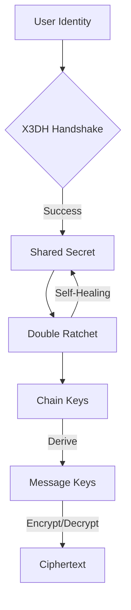

# Sibna Protocol v7 🔐

<p align="center">
  <strong>Production-Ready End-to-End Encrypted Messaging Protocol</strong>
</p>

<p align="center">
  <a href="LICENSE"></a>
  <a href="https://www.rust-lang.org/"></a>
  
  
</p>

---

## 🌟 Overview

**Sibna Protocol** is a high-assurance, memory-safe implementation of the **X3DH** (Extended Triple Diffie-Hellman) and **Double Ratchet** cryptographic protocols, providing end-to-end encryption for secure messaging applications.

Built in **Rust** for maximum security and performance, Sibna offers **independent SDKs** for multiple programming languages, making it easy to integrate secure messaging into any application.

### ✨ Key Features

- 🛡️ **Post-Compromise Security**: Self-healing cryptographic state machine
- ⚡ **High Performance**: Zero-cost abstractions with Rust-native core
- 📦 **Multi-Language Support**: Independent SDKs for Python, JavaScript, Dart/Flutter, and C++
- 🔐 **Zero-Knowledge Architecture**: Relay servers never access plaintext or metadata
- 🔒 **Battle-Tested Cryptography**: ChaCha20-Poly1305, X25519, Ed25519
- 🚀 **Production Ready**: Comprehensive tests and security audits

---

## 🚀 Quick Start

### Prerequisites

- **Rust** 1.70+ (for building the core library)
- **Python** 3.8+ (for Python SDK)
- **Node.js** 16+ (for JavaScript SDK)
- **Dart** 2.17+ / **Flutter** (for Dart SDK)
- **CMake** 3.15+ (for C++ bindings)

### Installation

Choose your preferred SDK:

#### 🐍 Python SDK

```bash
cd sdks/python
make build
pip install -e .
```

**Usage:**
```python
from sibna import SecureContext, Config

# Initialize context
ctx = SecureContext(Config(), password=b"your_master_password")

# Create session and encrypt
session = ctx.get_or_create_session(peer_id="alice")
ciphertext = session.encrypt(b"Hello, Alice!")
plaintext = session.decrypt(session.peer_id, ciphertext)
```

#### ⚡ JavaScript SDK

```bash
cd sdks/javascript
./build.sh
npm install
```

**Usage:**
```javascript
import { SibnaKernel } from 'sibna-js';

const kernel = new SibnaKernel();
await kernel.initialize({ masterKey: 'your_master_key' });

const encrypted = await kernel.encryptMessage('alice', 'Hello, Alice!');
const decrypted = await kernel.decryptMessage('alice', encrypted);
```

#### 💙 Dart/Flutter SDK

```bash
cd sdks/dart
./build.sh
```

**Add to `pubspec.yaml`:**
```yaml
dependencies:
  sibna_dart:
    path: ./sdks/dart
```

**Usage:**
```dart
import 'package:sibna_dart/sibna_dart.dart';

final ctx = SecureContext(Config(), password: "your_password");
final encrypted = await ctx.encrypt("alice", "Hello, Alice!");
final decrypted = await ctx.decrypt("alice", encrypted);
```

#### ⚙️ C++ Bindings

```bash
cd sdks/cpp
mkdir build && cd build
cmake ..
cmake --build .
```

---

## 📖 Documentation

- **[Quick Start Guide](docs/QUICK_START.md)** - Get started in 5 minutes
- **[Developer Guide](DEVELOPER_GUIDE.md)** - Development setup and architecture
- **[API Reference](docs/api-reference.md)** - Complete API documentation
- **[Deployment Guide](DEPLOYMENT.md)** - Production deployment instructions
- **[Security Policy](SECURITY.md)** - Security practices and reporting
- **[Whitepaper](docs/whitepaper.md)** - Protocol specification

---

## 🏗️ Architecture

Sibna implements a complete end-to-end encryption protocol:



### Cryptographic Primitives

| Component | Algorithm | Purpose |
|-----------|-----------|---------|
| **Key Exchange** | X25519 | Diffie-Hellman key agreement |
| **Signatures** | Ed25519 | Identity verification |
| **AEAD** | ChaCha20-Poly1305 | Authenticated encryption |
| **KDF** | HKDF-SHA256 | Key derivation |
| **Hashing** | BLAKE3 | Fast cryptographic hashing |

---

## 📂 Project Structure

```
sibna-protocol-v7/
├── core/                   # Reference Rust implementation
│   ├── src/               # Core protocol source code
│   └── Cargo.toml         # Rust package configuration
│
├── sdks/                   # Independent SDKs
│   ├── python/            # Python SDK with embedded core
│   ├── javascript/        # JavaScript/TypeScript SDK
│   ├── dart/              # Dart/Flutter SDK
│   └── cpp/               # C++ bindings
│
├── docs/                   # Documentation
├── examples/               # Usage examples
├── tests/                  # Integration tests
├── server/                 # Reference server implementation
│
├── README.md              # This file
├── LICENSE                # Apache-2.0 OR MIT
├── CONTRIBUTING.md        # Contribution guidelines
└── SECURITY.md            # Security policy
```

---

## 🧪 Testing

### Run Core Tests

```bash
cd core
cargo test --verbose
```

### Run Integration Tests

```bash
cd tests
python integration_test_full.py
```

### Run SDK-Specific Tests

Each SDK has its own test suite. See SDK-specific READMEs for details.

---

## 🤝 Contributing

We welcome contributions! Please see [CONTRIBUTING.md](CONTRIBUTING.md) for guidelines.

### Development Setup

1. Clone the repository
2. Install Rust toolchain
3. Build the core library: `cd core && cargo build --release`
4. Choose an SDK and follow its README

### Code Style

- **Rust**: Follow `rustfmt` and `clippy` guidelines
- **Python**: Follow PEP 8
- **JavaScript**: Use ES6+ with standard style
- **Documentation**: Clear, concise, and comprehensive

---

## 🔒 Security

Security is our top priority. Please see [SECURITY.md](SECURITY.md) for:
- Security best practices
- Vulnerability reporting
- Security audit results

**Found a security issue?** Please email security@sibna.example (replace with actual contact) instead of opening a public issue.

---

## 📜 License

This project is dual-licensed under:
- **Apache License 2.0** ([LICENSE-APACHE](LICENSE))
- **MIT License** ([LICENSE-MIT](LICENSE))

You may choose either license for your use.

---

## 🌐 Resources

- **Documentation**: [docs/](docs/)
- **Examples**: [examples/](examples/)
- **API Reference**: [docs/api-reference.md](docs/api-reference.md)
- **Changelog**: [CHANGELOG.md](CHANGELOG.md)

---

## 💬 Community & Support

- **Issues**: [GitHub Issues](https://github.com/your-org/sibna-protocol/issues)
- **Discussions**: [GitHub Discussions](https://github.com/your-org/sibna-protocol/discussions)
- **Contributing**: [CONTRIBUTING.md](CONTRIBUTING.md)

---

## 🙏 Acknowledgments

Built with ❤️ by the **Sibna Team**

Special thanks to:
- The Signal Protocol team for the Double Ratchet specification
- The Rust cryptography community
- All contributors and supporters

---

<p align="center">
  <strong>Sibna Protocol v7 - Secure Communication for Everyone</strong>
</p>
